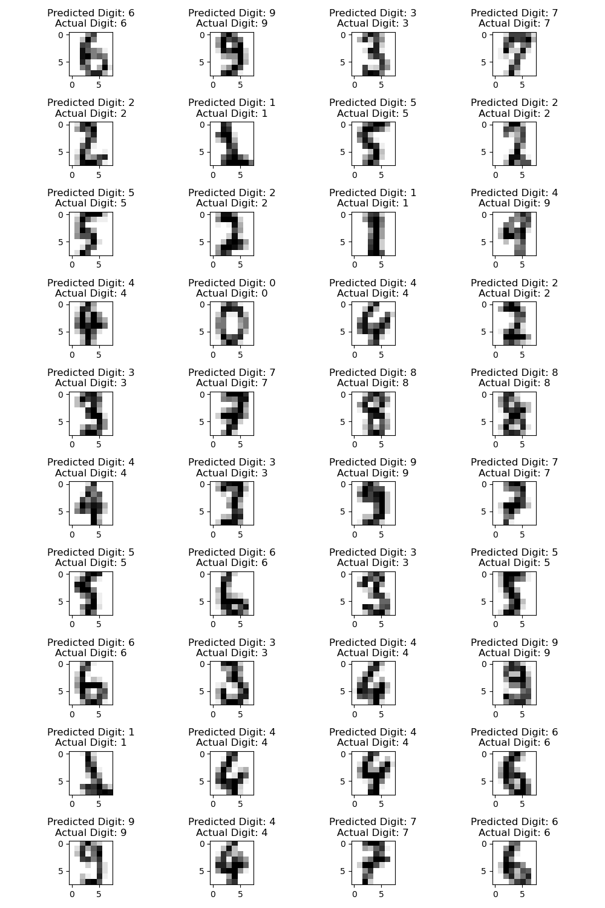

# ANN Digit Classification

This project implements an Artificial Neural Network (ANN) using PyTorch to classify digits from the popular sklearn digits dataset.

## Table of Contents

- [Introduction](#introduction)
- [Dataset](#dataset)
- [Installation](#installation)
- [Model Architecture](#model-architecture)
- [Training](#training)
- [Results](#results)

## Introduction

This project demonstrates how to build a simple ANN for classifying images of digits (0-9) using PyTorch. The model is trained on the `digits` dataset provided by sklearn, which consists of 8x8 pixel images of handwritten digits.

## Dataset

The dataset used in this project is the `digits` dataset from the sklearn library. It contains 1,797 samples with 64 features each, where each feature corresponds to a pixel in an 8x8 image.

## Installation

### Anaconda Environment

To set up the environment using Anaconda, follow these steps:

1. **Create a new environment**:

   ```bash
   conda create --name digit_classification python=3.8
   ```

2. **Activate the environment**:

   ```bash
   source activate digit_classification
   ```

3. **Install the required packages**:

   You can install the dependencies directly from the `requirements.txt` file:

   ```bash
   pip install -r requirements.txt
   ```

## Model Architecture

The model, `DigitClassifierNN`, is a simple feedforward neural network with the following architecture:

- **Input Layer**: 64 neurons, corresponding to the 8x8 pixel grid of the input images.
- **Hidden Layer**: 64 neurons with ReLU activation.
- **Output Layer**: 10 neurons, one for each digit class (0-9).

## Training

The model is trained using cross-entropy loss and optimized using Stochastic Gradient Descent (SGD). The dataset is split into training and testing sets, and the model is evaluated on the test set.

## Results

After training the `DigitClassifierNN` on the sklearn digits dataset, the model achieved the following results:

- **Training Accuracy**: 93.06%
- **Loss**: Cross-Entropy Loss stabilized at 0.0191


The plot above shows the average cross-entropy loss over 40 epochs. As training progresses, the loss consistently decreases, indicating that the model is learning effectively.

### Predictions

Below is a grid of predicted versus actual digit images:



Each image in the grid shows the predicted digit alongside the actual digit. This visualization helps assess the model's performance in a straightforward manner.
